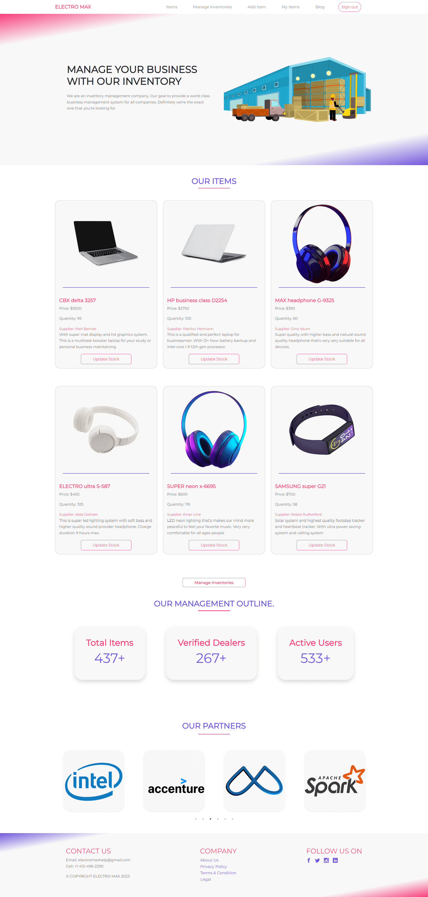

# 🚀 Author:

# [Hi, I'm Palak! 👋](https://github.com/palakxdev)


## Short Description:
This is an inventory management website. Here are some inventory items with detailed information. A registered user can update the items' stock. The user can update the stocked item quantity by increasing or decreasing. Also, users can add their own items by using the add item route. Then the user can see their added item in the My Items route, and they have the ability to delete their added item.

The user can register using the Google sign-in method or the email password-based sign-in method.

There is also a route called Manage Inventories. The user will see all the inventory items there, and they can delete any item they want.

## To see the live website: [Click Here](https://electro-max.web.app/)

## Features

👉 Dynamic content rendered using React components

👉 Protected route with user authentication

👉 Responsive design for optimal user experience on all devices

👉 User authentication and authorization

👉 Clean, organized codebase using modern JavaScript and React best practices

👉 The MongoDB database used to store the data.


## Built With

- [ReactJS](https://reactjs.org/) - JavaScript library for building user interfaces
- [Bootstrap](https://getbootstrap.com/) - CSS framework for responsive design
- [React bootstrap](https://react-bootstrap.github.io/) - CSS framework for responsive design
- [React countup](https://github.com/glennreyes/react-countup) - A configurable React component for countup system
- [React slick and slick carousel](https://react-slick.neostack.com/docs/get-started) - For a different, responsive and attractive carousel creation
- [Sweetalert](https://sweetalert.js.org/guides/) - For responsive and attractive user interface (alert modal)
- [React scrool trigger](https://github.com/ryanhefner/react-scroll-trigger) - React component that monitors scroll events to trigger callbacks when it enters, exits and progresses through the viewport.
- [Google firebase](https://firebase.google.com/docs/auth/web/start) - Authentication system for users to sign in and register
- [React firebase hooks](https://github.com/CSFrequency/react-firebase-hooks) - Authentication system for users to sign in and register
- [React icons](https://react-icons.github.io/react-icons/) - To utilize ES6 imports that allow us to include only the icons that our project is using
- [React toastify](https://fkhadra.github.io/react-toastify/introduction) - To show the user different messages and increase user experience


## Tech Stack

**Client:** HTML5, CSS3, JavaScript, React, Bootstrap, React bootstrap

**Server:** NodeJS, Express, MongoDB

## Run Locally

Clone the project

```bash
  git clone https://link-to-project
```

Go to the project directory

```bash
  cd my-project
```

Install dependencies

```bash
  npm install
```

Start the server

```bash
  npm run start
```


## Environment Variables

To run this project, you will need to add the following environment variables to the .env.local file

`apiKey`

`authDomain`

`projectId`

`storageBucket`

`messagingSenderId`

`appId`

## Screenshots




## Feedback

If you have any feedback, please reach out to me at palakxdev@gmail.com

## 🔗 Links: Reach me out

[](https://linkedin.com/in/palakxdev/) 

[](https://twitter.com/palakxdev/)

[](https://facebook.com/palakxdev/)